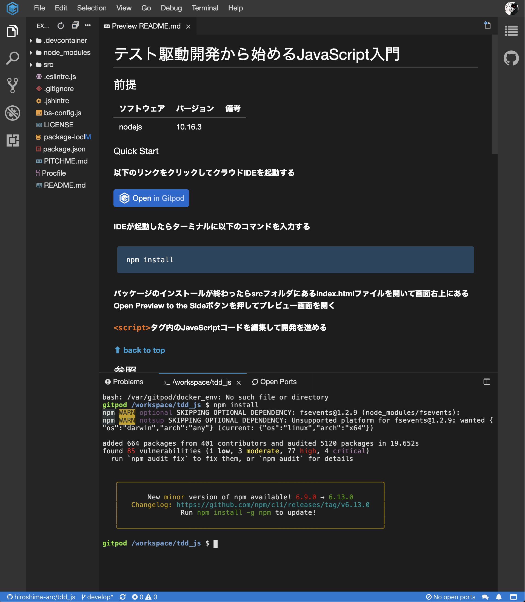

# テスト駆動開発から始めるJavaScript入門

## 前提

| ソフトウェア   | バージョン | 備考 |
| :------------- | :--------- | :--- |
| nodejs         | 10.16.3     |      |


### Quick Start

#### 以下のリンクからクラウドIDEを起動する

[](https://gitpod.io/#https://github.com/hiroshima-arc/tdd_js)


#### IDEが起動したらターミナルに以下のコマンドを入力する

```bash
npm install
```



#### パッケージのインストールが終わったらsrcフォルダにあるindex.htmlファイルを開いて画面右上にあるOpen Preview to the Sideボタンを押してプレビュー画面を開く


#### `<script>`タグ内のJavaScriptコードを編集して開発を進める


**[⬆ back to top](#構成)**

## 参照

- [50 分でわかるテスト駆動開発](https://channel9.msdn.com/Events/de-code/2017/DO03?ocid=player)